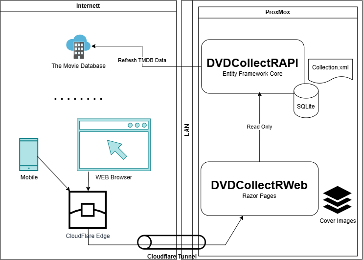

# DVDCollectR
A Web Application that enables you to import your DVD Collection from [DVD Profiler](http://www.invelos.com/) and make it available as - you will never guess this - a Web Application. 

sales pictures go here ;)

## DVD Profiler - Getting Your Data
So, back in April 2009 I bougth a license for [DVD Profiler](http://www.invelos.com/) and between 2009 and 2012 I cataloged my collection of 453 DVD's. This year I started to wonder if it was possible to:
* A: Rescue this data about my DVD collection from my old Acer Aspire One Netbook.
* B: Create a Web App so that I could carry this collection with me and access it from my phone.

### Exporting Data From DVD Profiler
Luckily exporting the data from DVD Profiler to XML is quite easy. You'll find the option under **File** -> **Export Profile Database...**. Just accept the default and save everything as a Collection.xml file. Remember, you can use this data as long as it's for your personal use.

We now have the metadata for all our DVD's. Then we need to find the back and front cover images. These are situated on Windows under your home directory:

%USERPROFILE%\Documents\DVD Profiler\Databases\Default\Images

The images are stored with the id of the profile they belong to, with a trailing **f** for front or **b** for back. E.g.
* filename: 044005939026.2f.jpg
* Profile Id: **044005939026.2**f.jpg
* Front cover: 044005939026.2**f**.jpg

There's also a **Thumbnails** directory under the Images folder that contains smaller Thumbnail friendly versions of all the images using the same naming convention. 

## DVD CollectR - The Web App
Even though the data exported from DVD Profiler is the foundation of this project (no data, no fun) this GitHub project is of course all about the Web App. And since I also discovered that DVD Profiler is still alive and kicking, **AND** that my license from 2009 is still valid on the latest version from 2017, this project focuses on the __display__ of my collection. I will still continue to use [DVD Profiler](http://www.invelos.com/) to keep my collection up to date. 

Anyways, let's dive into the details:

### Architecture

All communication is **server-side**: Razor PageModels call `DvdApiClient` (defined in `DVDCollectRShared/APIClient/DvdApiClient.cs`) during `OnGet`/`OnPost` handlers. No client-side SPA — except the Settings page which uses `fetch()` to poll sync status every 12 seconds.

Cover images are served as **static files** from `wwwroot/images/DVDs/`, **not** from the API.

---

### Pages → API Endpoints

| Razor Page | Route | API Endpoint(s) | Purpose |
|---|---|---|---|
| **Collection** | `/Collection` | `GET /api/dvds?title=&actor=&genre=&page=&pageSize=` | Search/filter/paginate DVD listing |
| | | `GET /api/genres` | Populate genre filter dropdown |
| **Details** | `/Details/{id}` | `GET /api/dvds/{id}` | Full DVD details page |
| **Settings** | `/Settings` | `GET /api/tmdb/settings/key` | Show current TMDB API key (masked) |
| | | `PUT /api/tmdb/settings/key` | Save a new TMDB API key |
| | | `POST /api/tmdb/sync/start` | Kick off TMDB metadata sync |
| | | `GET /api/tmdb/sync/status` | Poll sync progress (client-side JS, 12s interval) |
| Index | `/` | — | Static home page (logo only) |
| Login | `/Login` | — | Local cookie auth, no API call |
| Logout | `/Logout` | — | Local sign-out, no API call |
| Error | `/Error` | — | Error display only |

---

### API Endpoints Reference

| Method | Route | Controller | Description |
|---|---|---|---|
| `GET` | `/api/dvds` | `DvdsController` | Search/paginate DVDs (`?title=&actor=&genre=&page=&pageSize=`) |
| `GET` | `/api/dvds/{id}` | `DvdsController` | Get single DVD by integer ID |
| `GET` | `/api/genres` | `GenresController` | List all distinct genre names (sorted) |
| `POST` | `/api/tmdb/sync/start` | `TmdbController` | Start TMDB sync for stale/missing metadata |
| `GET` | `/api/tmdb/sync/status` | `TmdbController` | Get current sync progress (`Idle`/`Running`/`Completed`) |
| `GET` | `/api/tmdb/settings/key` | `TmdbController` | Get masked TMDB API key |
| `PUT` | `/api/tmdb/settings/key` | `TmdbController` | Save new TMDB API key |

---

### Database Overview

Single **SQLite** file at `DVDCollectRAPI/Data/dvds.db`. EF Core manages schema via migrations.

#### Tables

##### `DVDs` (backed by `DvdEntity`)

The main table — one row per DVD from the XML import.

| Column | Type | Notes |
|---|---|---|
| `Id` | int (PK) | Auto-increment |
| `ProfileId` | string (unique) | DVD Profiler's own ID |
| `Title` | string | Required |
| `OriginalTitle` | string? | |
| `SortTitle` | string? | |
| `ProductionYear` | int? | |
| `Released` | string? | |
| `RunningTime` | int? | |
| `Rating` | string? | |
| `RatingSystem` | string? | |
| `RatingAge` | string? | |
| `RatingDetails` | string? | |
| `CountryOfOrigin` | string? | |
| `UPC` | string? | |
| `CollectionNumber` | string? | |
| `CaseType` | string? | |
| `Overview` | string? | |
| `MediaTypes` | string? | |
| `Regions` | string? | |
| `Studios` | string? | |
| `Director` | string? | |
| `Actors` | string? | |
| `AudioTracks` | string? | |
| `Subtitles` | string? | |
| `DiscCount` | int? | |
| `PurchaseDate` | string? | |
| `PurchasePrice` | decimal? | |
| `PurchasePlace` | string? | |
| `WishPriority` | int? | |
| `LastEdited` | string? | |
| `CreatedAt` | string (ISO 8601) | Required, set on first import |
| `UpdatedAt` | string (ISO 8601) | Required, updated on re-import |

**API usage:** `GET /api/dvds`, `GET /api/dvds/{id}` — read only.

**Populated by:** `XmlImportService` (startup `IHostedService`) — deserializes `Collection.xml`, upserts by `ProfileId`.

---

##### `Genres` (backed by `GenreEntity`)

Lookup table of genre names.

| Column | Type | Notes |
|---|---|---|
| `Id` | int (PK) | Auto-increment |
| `Name` | string | Required |

**API usage:** `GET /api/genres` — returns all names sorted.

**Populated by:** `XmlImportService` — creates new genre records as encountered during import.

---

##### `DVDGenres` (join table, auto-generated by EF Core)

Many-to-many link between `DVDs` and `Genres`.

| Column | Type |
|---|---|
| `DvdId` | int (FK → DVDs.Id) |
| `GenreId` | int (FK → Genres.Id) |

**API usage:** Implicit — `GET /api/dvds` includes genres per DVD; `GET /api/genres` returns unique names.

**Populated by:** `XmlImportService` — clears and re-adds associations each import.

---

##### `Tmdb` (backed by `TmdbEntity`)

TMDB metadata synced for each DVD.

| Column | Type | Notes |
|---|---|---|
| `DvdId` | int (PK + FK → DVDs.Id) | One-to-one with DVD |
| `PosterPath` | string? | Relative poster path from TMDB |
| `VoteAverage` | double? | |
| `VoteCount` | int? | |
| `Overview` | string? | TMDB plot overview |
| `LastUpdated` | string? (ISO 8601) | When this row was last refreshed |
| `TmdbId` | int? | TMDB ID of item |

**API usage:** `GET /api/dvds/{id}` — included in response; `POST /api/tmdb/sync/start` — background service writes here.

**Populated by:** `TmdbSyncService` (background `BackgroundService`) — queries TMDB API for DVDs missing data or with data older than 30 days.

---

##### `AppSettings` (backed by `AppSettingEntity`)

Simple key-value store.

| Column | Type | Notes |
|---|---|---|
| `Key` | string (PK) | e.g. `"TMDB_API_KEY"` |
| `Value` | string | Required |

**API usage:** `GET /api/tmdb/settings/key` — read; `PUT /api/tmdb/settings/key` — write.

**Populated by:** User via Settings page (or falls back to `appsettings.json` `TMDB_API_KEY` config).

---

#### Data Flow (Startup)

1. `XmlImportService.OnStartAsync` calls `Database.MigrateAsync()` — ensures schema is current
2. Reads `Data/Collection.xml`, deserializes via `XmlSerializer` into `DVDCollectRShared.DVDProfiler.Collection`
3. Upserts DVDs by `ProfileId`: existing rows get `UpdatedAt` refreshed, new rows get `CreatedAt` + `UpdatedAt`
4. Creates missing `GenreEntity` records; clears and re-adds `DVDGenres` associations
5. `SaveChangesAsync` once at end of import

## Development
### Setup Solution In Visual Studio 2026
I used Visual Studio 2026 for this project. Clone this repo (entire solution). Then we need to copy in the data we extracted from DVD Profiler.
Collection.xml file should be copied to: 
* DVDCollectR\DVDCollectRAPI\Data\Collection.xml

Then we need to copy in the cover images to make the application shine:
* %USERPROFILE%\Documents\DVD Profiler\Databases\Default\Images\ *
* Including the Thumbnails sub folder is copied to:
* DVDCollectR\DVDCollectRWeb\wwwroot\images\DVDs\

E.g. the image we discussed above 044005939026.2f.jpg should be found here DVDCollectR\DVDCollectRWeb\wwwroot\images\DVDs\044005939026.2f.jpg once copying is done.  

To run the solution in development you just have to ensure that both the API and the Web project is started up as the latter depends on the prior. 

Want to bring this to production? I'm currently running this as two seperate services on Ubuntu (API and Web) then I use a Cloudflare tunnel to expose my Web Application to the public internet. I'm not going to detail this here and don't ask me to do it either. Do your own research on what's good and safe here. 

### Built In Collaboration With AI
I'll just throw in a small disclamer: ~90% of this was built using AI (OpenCode with DeepSeek V4 Flash, and MiMo v.2.5). The structure of the project (API, Web, Shared), the authentication, a few pages with basic navigation and the classes needed to read the Collection.xml file I had already setup before I let AI loose. But one of the side goals of this project was to push these two AI models to the max to see what they can do. 

The experience was mostly good except for one rabbit hole where the AI model (DeepSeek) insisted on good error handling and fallbacks instead of fixing the core issue (why the DB migration failed in the first place). This was kinda funny and frustrating at the same time :) After some yelling at the model and re-focus we got there in the end. But if you do not catch situations like this it can "spin out of control" generating wast amounts of code that isn't necessary. 

### Visual Studio 2026: Paste XML As Classes
Surly someone has created something that can translate an XML file to the classes needed to read it in C#!? Looking online the answer kinda suprised me as I was not aware of this functionality in Visual Studio 2026 but it's actually built in and you can find it under **Edit**->**Paste Special**->**Paste XML As Classes**

It says that a sample xml file will do, and my sample was my entire ~8mb Collection.xml file and it worked! Zabing!
